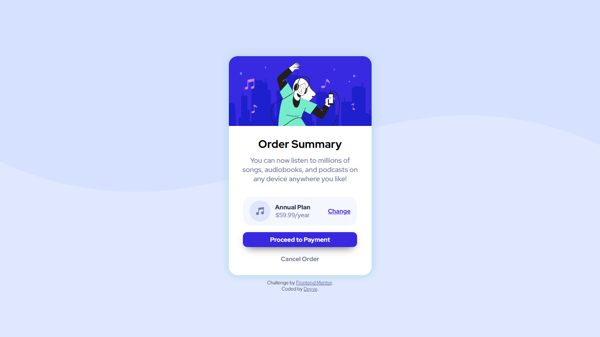

# Frontend Mentor - solução de cartão de resumo do pedido

Esta é uma solução para o desafio do cartão de resumo do pedido no Frontend Mentor . Os desafios do Frontend Mentor ajudam você a melhorar suas habilidades de codificação criando projetos realistas.

## Índice:

- [Visão geral](#overview)
  - [Screenshot](#screenshot)
  - [Links](#links)
- [My process](#my-process)
  - [Built with](#built-with)
- [Author](#author)

### Screenshot:

### Links:

[Live site URL here](https://deyvesu.github.io/order-summary/)

## Meu processo:

### Construído com:

- Semantic HTML5 markup
- CSS custom properties
- Flexbox

## Author:

- Website - [Deyve](https://github.com/Deyvesu)
- Frontend Mentor - [@yourusername](https://www.frontendmentor.io/profile/Deyvesu)
- Twitter - [@yourusername](https://twitter.com/Anteikhu_D)

